# General
## Diagrama de arquitectura
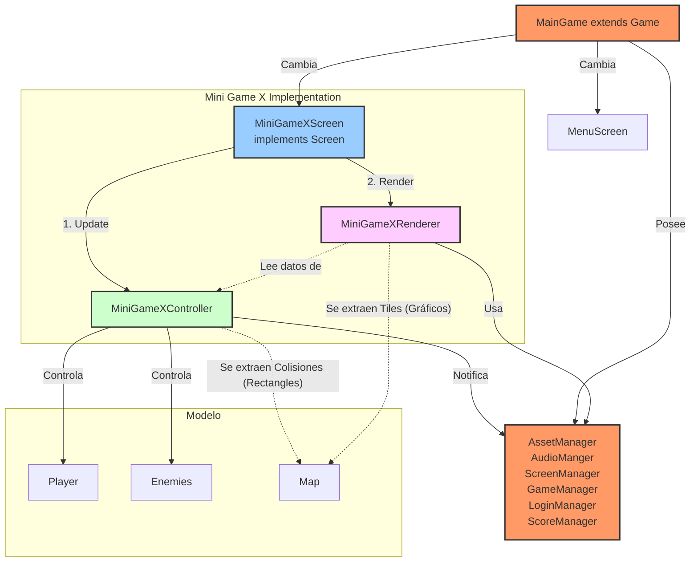
## Diagrama de arquitectura modular
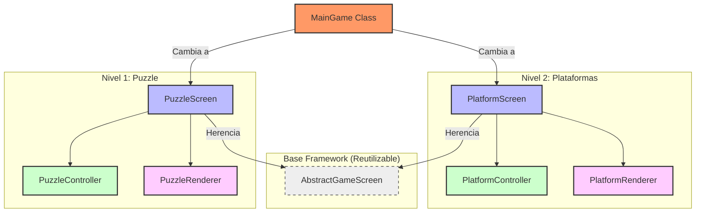
## Diagrama de flujo gráfico
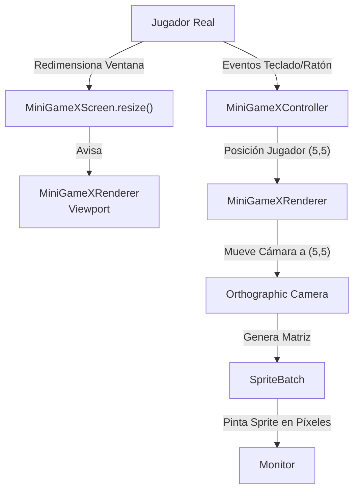
## Diagrama de flujo tratamiento input de usuario
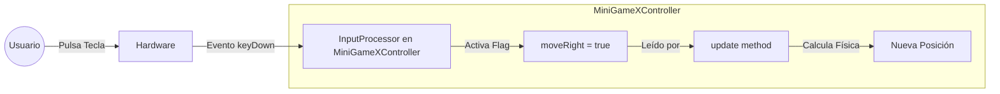
## Secuencia ciclo de vida de un minijuego
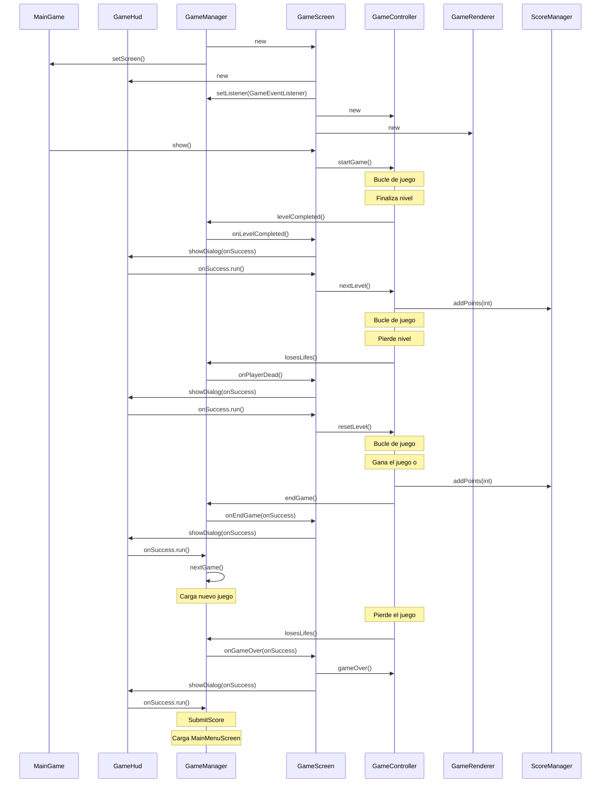
## Secuencia bucle de juego
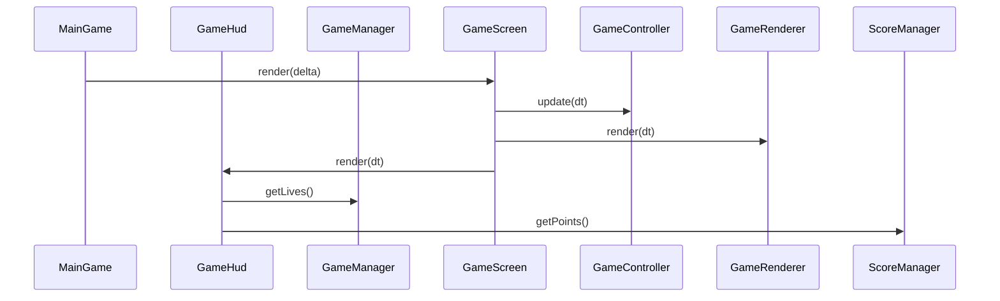
## Secuencia cambio de nivel
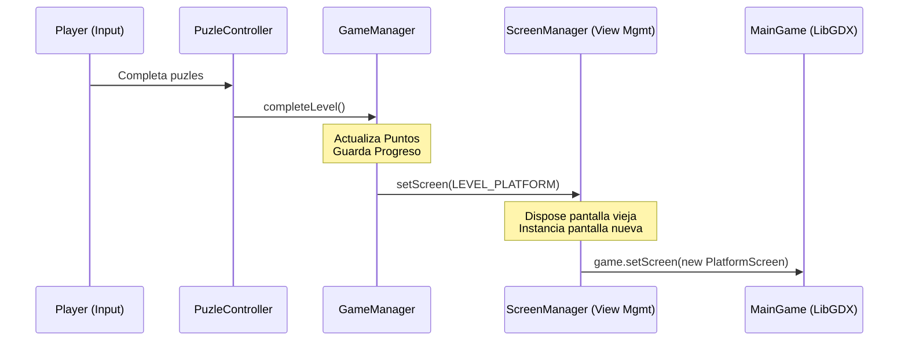
# Puzle
## Diagrama Arquitectura
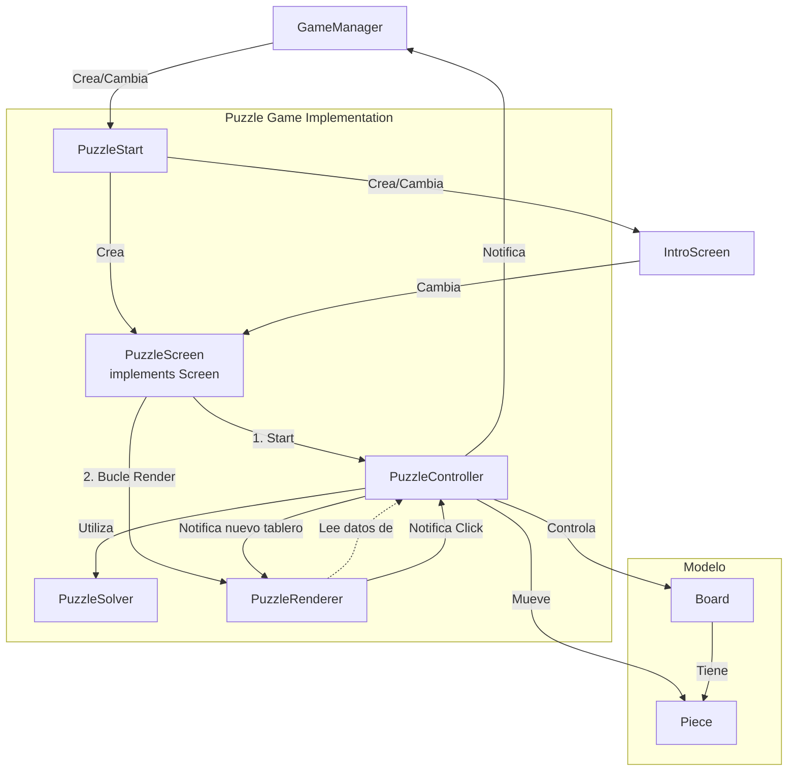
## Secuencia inicio de juego
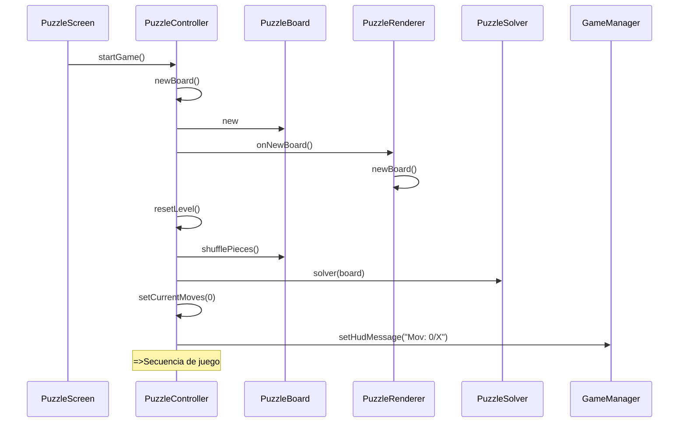
## Secuencia de juego
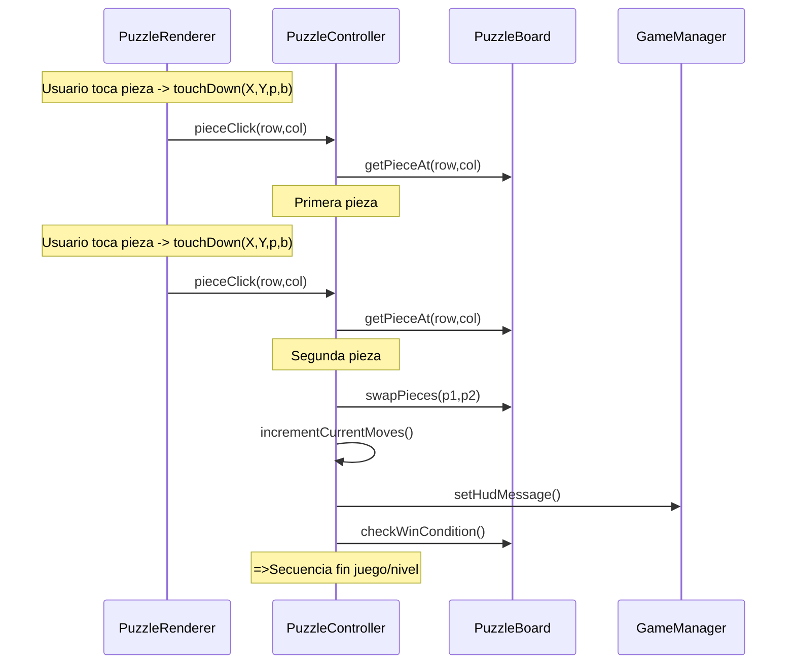
## Secuencia fin juego/nivel
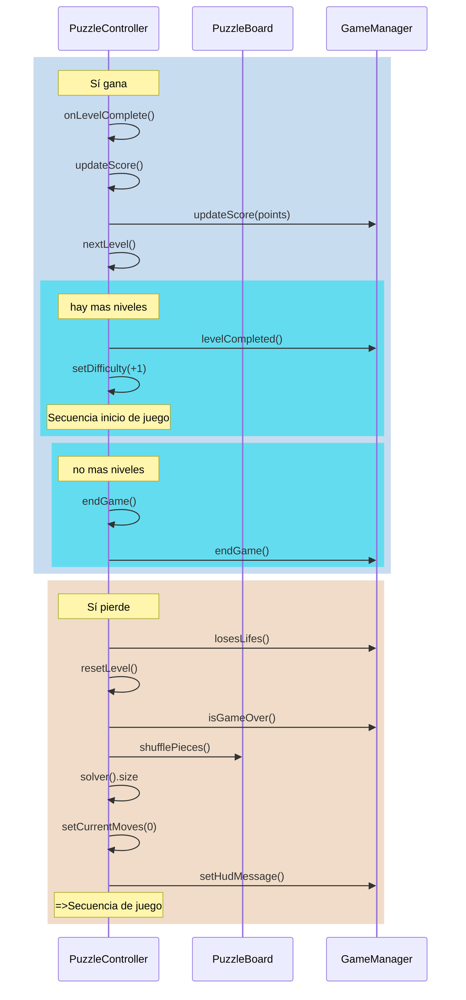
